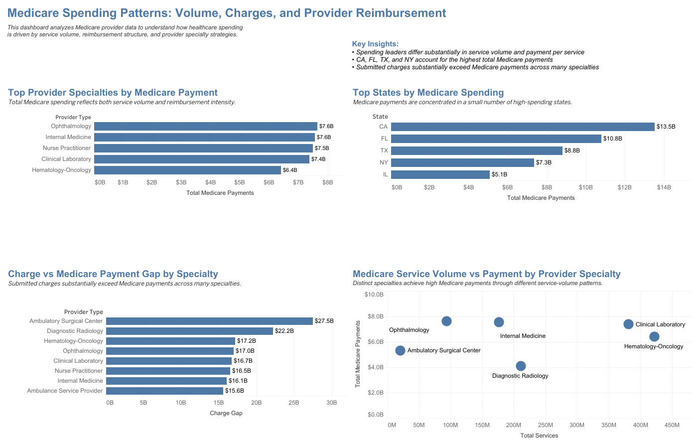

# CMS Medicare Provider Analysis

*Healthcare analytics project using Python, SQL, SQLite, and Tableau to analyze Medicare provider spending, service volume, charges, and reimbursement patterns.*



[View Interactive Tableau Dashboard](https://public.tableau.com/app/profile/thuan.tran6584/viz/CMSMedicareProviderAnalysis/MedicareSpendingPatternsVolumeCostandProviderStrategy)

## Project Overview

This project analyzes CMS Medicare Physician & Other Practitioners data (2023) to explore healthcare spending patterns, reimbursement structures, and provider specialty strategies across the United States.

The analysis combines Python, SQL, SQLite, and Tableau to identify key drivers of Medicare spending and understand how provider specialties differ in service volume, reimbursement, and payment outcomes.

---

## Dashboard

### Dashboard Title

**Medicare Spending Patterns: Volume, Charges, and Provider Reimbursement**

The dashboard examines:

* Top provider specialties by Medicare payment
* Geographic concentration of Medicare spending
* Charge versus Medicare reimbursement gaps
* Service volume versus payment relationships across specialties

### Tableau Dashboard

[CMS Medicare Provider Analysis Dashboard](https://public.tableau.com/app/profile/thuan.tran6584/viz/CMSMedicareProviderAnalysis/MedicareSpendingPatternsVolumeCostandProviderStrategy)

---

## Dataset

**Source:** CMS Medicare Physician & Other Practitioners Data (2023)

**Original Dataset Size:** Approximately 1.2 million records

The original CMS dataset exceeds GitHub file size recommendations. To keep this repository lightweight and reproducible, a sample dataset is included for demonstration purposes.

Data fields include:

* Provider specialty
* State
* Total services
* Submitted charges
* Medicare payments

---

## Business Questions

1. Which provider specialties receive the highest Medicare payments?
2. Which states account for the largest share of Medicare spending?
3. How large is the gap between submitted charges and Medicare reimbursement?
4. Is Medicare spending primarily driven by service volume or reimbursement levels?

---

## Tools & Technologies

* Python (Pandas)
* SQLite
* SQL
* Tableau Public

---

## Key Findings

### 1. Spending leaders differ substantially in service volume and payment per service

Leading specialties generate similar levels of total Medicare payments through different combinations of service volume and reimbursement intensity.

### 2. Medicare spending is geographically concentrated

California, Florida, Texas, and New York account for the highest total Medicare payments in this analysis.

### 3. Submitted charges substantially exceed Medicare payments

Large differences between submitted charges and Medicare payments are observed across many specialties, illustrating the distinction between billed charges and Medicare reimbursement.

### 4. Specialties exhibit distinct payment-volume patterns

Different specialties achieve high Medicare payments through different service-volume patterns, indicating that total spending reflects both utilization and reimbursement intensity.

---

## Project Workflow

CMS Medicare Data

→ Python Data Cleaning

→ SQLite Database

→ SQL Analysis

→ CSV Export

→ Tableau Dashboard

→ Business Insights

---

## Repository Structure

```text
cms-medicare-provider-analysis/
│
├── README.md
│
├── data/
│   ├── raw/
│   │   ├── cms_medicare_sample_2023.csv
│   │   └── Medicare_Physician_Other_Practitioners_by_Provider_2023.csv
│   │
│   └── processed/
│       ├── top_specialties.csv
│       ├── top_states.csv
│       └── charge_gap.csv
│
├── python/
│   ├── create_sample_data.py
│   └── load_clean_to_sqlite.py
│
├── sql/
│   ├── 01_top_specialties.sql
│   ├── 02_top_states.sql
│   └── 03_charge_gap.sql
│
├── tableau/
│   └── CMS Medicare Provider Analysis.twbx
│
├── screenshots/
│   └── dashboard.png
│
└── cms_medicare.db
```

> Note: The full CMS source dataset and local SQLite database may be excluded from the public repository because of file size. The included sample supports review of the project structure and workflow.

---

## Skills Demonstrated

* SQL querying and aggregation on large healthcare datasets
* Data cleaning and preprocessing using Python (Pandas)
* SQLite-based analytical workflow
* Healthcare utilization and reimbursement analysis
* Tableau dashboard development and data visualization
* Business storytelling with data
* Public health analytics

---

## Future Improvements

* Add multi-year trend analysis using additional CMS data
* Expand provider-level analysis for NPI-level insights
* Extend payment-per-service analysis across specialties and geographic markets
* Explore predictive analytics for healthcare spending trends

---

## Author

**Thuan Tran**

Healthcare Data Analytics Portfolio Project

Buffalo, New York
